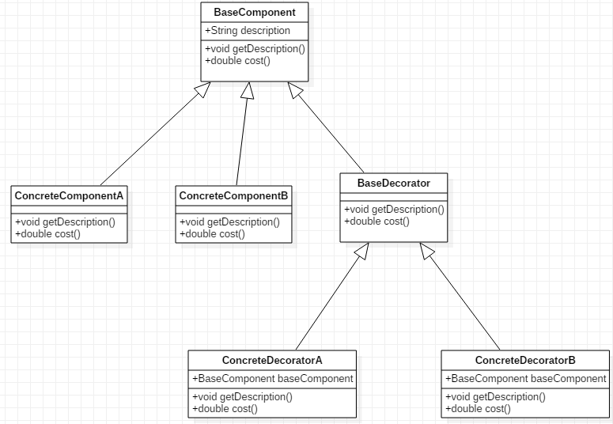

# 装饰者模式
## 奶茶店的例子
奶茶店里有许多品类的奶茶，比如：烧仙草奶茶，四季春茶，四季奶青，金桔柠檬，波霸奶茶，芒果沙冰等等。而且，根据客户的不同需求，冰的多少，甜度等，所生产的商品以及生产这些商品的成本也会不一致。如果让这些不同口味饮品都继承子一个父类Component，那么随着饮品种类的增多，代表着这些饮品种类的实体类也会越来越多。
假设饮料有m种，甜度可选范围有n种，那么我们必须要准备m*n个实体类，而且每增加一款饮品，就必须增加n个代表不同甜度的实体类。

分析:上述的饮品还可以大致分为三个种类：奶茶类，茶类，沙冰类。根据配料的不同(比如:甜度，冰的多少,原材料等)奶茶店所花费的成本也不同。
为此，我们就需要根据客户的不同需求来组合饮品、甜度、冰量、原材料来生产饮料
## 装饰者模式类图
    
在上述例子中，所有的奶茶（ConcreteComponentA）、茶（ConcreteComponentB）、沙冰（ConcreteComponentC）、配料(BaseDecorator)都继承自饮品类（BaseComponent），而配料又分为甜度（ConcreteDecoratorA）、冰量（ConcreteDecoratorA）。此处，甜度、冰量就可以充当装饰者，来装饰饮品。  
### 代码实现
抽象类：饮品：是具体饮料和配料的父类  

```java
public abstract class BaseBeverage {
    String description;

    /**
     * 饮品描述
     * @return description
     */
    public String getDescription(){
        return description;
    }

    /**
     *  计算成本
     * @return  cost
     */
    public abstract double cost();
}
```
茶：  

```java
public class Tea extends BaseBeverage  {
    public Tea(){
        description="抹茶";
    }
    @Override
    public double cost() {
        return 5;
    }
}
```
配料的抽象类：是所有配料的父类  

```java
public abstract class BaseBurdening  extends BaseBeverage {

    /**
     *  配料的花费
     * @return cost
     */
    @Override
    public  abstract double cost();
}
```
配料：糖。因为要往饮品中增加配料，所以要接受一个饮品对象

```java
public class Ice extends BaseBurdening {
    private BaseBeverage baseBeverage;

    /**
     *  要往饮品中增加配料，所以要接受一个饮品对象
     * @param baseBeverage BaseBeverage
     */
    public Ice(BaseBeverage baseBeverage){
        this.baseBeverage=baseBeverage;
    }
    @Override
    public String getDescription() {
        return baseBeverage.getDescription()+",一份冰";
    }
    /**
     * 配料的花费+饮料的花费=总的花费
     * @return totalCost
     */
    @Override
    public double cost() {
        return 0.7+baseBeverage.cost();
    }
}
```
配料：冰块  

```java
public class Sugar extends BaseBurdening {
    private BaseBeverage baseBeverage;
    public Sugar( BaseBeverage baseBeverage ){
        this.baseBeverage=baseBeverage;
    }
    @Override
    public String getDescription() {
        return baseBeverage.getDescription()+",单糖";
    }

    /**
     * 配料的花费+饮料的花费=总的花费
     * @return totalCost
     */
    @Override
    public double cost() {
        return 0.5+baseBeverage.cost();
    }
}
```
测试一下：  

```java
public class DecoratorMain {
    public static void main(String[] args) {
        BaseBeverage tea = new Tea();
        System.out.println("原味茶："+tea.getDescription()+","+tea.cost());
        //正确写法:饮料+糖+冰 之后还是饮料，所以不能返回Ice,Sugar对象
        tea =new Ice(tea);
        tea=new Sugar(tea);
        System.out.println(tea.getDescription()+","+tea.cost());
        //错误写法
//        Ice ice = new Ice(tea);
//        System.out.println(tea.getDescription()+","+tea.cost());
//        System.out.println("-----------------");
//        Sugar sugar = new Sugar(tea);
//        System.out.println(tea.getDescription()+","+tea.cost());

    }
}
```
```log
原味茶：抹茶,5.0
抹茶,一份冰,单糖,6.2
```
